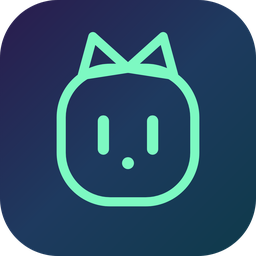
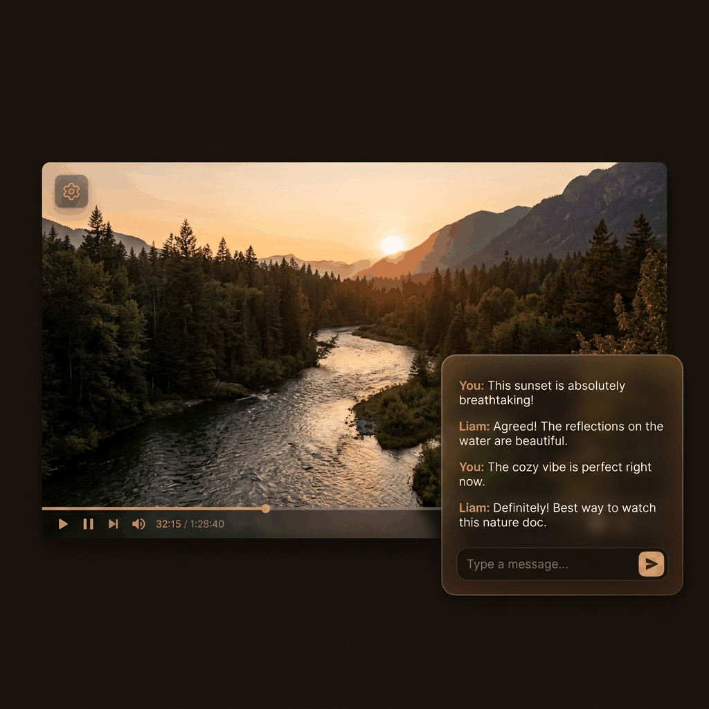
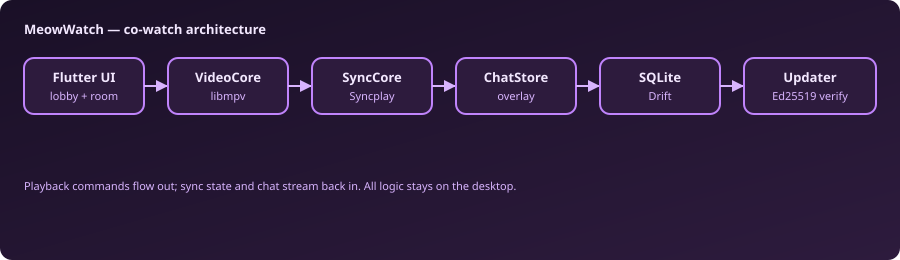

<p align="center">
  
</p>

<h1 align="center">MeowWatch</h1>

<p align="center">
  <strong>Watch videos together — synced playback, floating chat, zero countdowns.</strong>
</p>

<p align="center">
  <a href="https://github.com/PeterShanxin/MeowWatch/releases/tag/v0.47.0-alpha"></a>
  
  
  
  
  <a href="LICENSE"></a>
</p>

<p align="center">
  <a href="https://github.com/PeterShanxin/MeowWatch/releases/tag/v0.47.0-alpha"><strong>Download 0.47.0-alpha</strong></a>
  &nbsp;·&nbsp;
  <a href="https://github.com/PeterShanxin/MeowWatch/releases">All releases</a>
  &nbsp;·&nbsp;
  <a href="https://github.com/PeterShanxin/MeowWatch/releases/tag/v0.47.0-alpha">Release notes</a>
</p>

<p align="center">
  
</p>

Windows x64 zip on that tag: [MeowWatch-windows-x64.zip](https://github.com/PeterShanxin/MeowWatch/releases/download/v0.47.0-alpha/MeowWatch-windows-x64.zip) ([`.sig`](https://github.com/PeterShanxin/MeowWatch/releases/download/v0.47.0-alpha/MeowWatch-windows-x64.zip.sig)). After the first install, MeowWatch updates itself in-place from a signed Cloudflare R2 manifest.

---

## ✨ What it does

Remote watch parties usually mean voice-call countdowns and drift. MeowWatch gives you **one room code, synchronized playback, and chat on the video**.

1. **Start or join a room** — the code copies to your clipboard.
2. **Load the same video** on both machines (drag-and-drop or paste a URL).
3. **Stay in sync** — play, pause, and seek propagate through Syncplay.
4. **Talk while you watch** — floating chat, reactions, and typing indicators.

## 🎯 Features

| Feature | Description |
| --- | --- |
| **Precision sync** | Custom Dart Syncplay client with stateful heartbeat and convergence. |
| **Floating chat** | Glass-card overlay with corner snap, peek tab, and Tab-key toggle. |
| **Three themes** | Cozy, Cinema Noir, and Glass Aurora — persisted in SQLite. |
| **Drag & drop playback** | Drop a local video; libmpv handles playback. |
| **Continue watching** | SQLite history with resume position and one-click resume. |
| **Smart auto-pause** | Pauses when sync drops or a friend disconnects (2 s debounce). |
| **Reactions & typing** | Emoji bursts and typing indicators over a control channel. |
| **Signed auto-update** | Ed25519-verified in-app updates from Cloudflare R2. |

## 💬 UX decisions

- Room code copied to clipboard on create.
- Idle cat mascot while waiting for a friend.
- Chat card remembers dock corner and size per room.
- Auto-assigned username when the field is blank.
- What's-new modal after updates.

## ⚡ Engineering

- Flutter Windows desktop with commands-in / streams-out architecture.
- Custom Syncplay protocol client (TCP + startTLS).
- Headless-testable pure logic split from widgets.
- Drift/SQLite persistence for profiles, history, and settings.
- Signed release pipeline with fail-closed updater verification.
- Six shipped product phases, 40+ alpha releases.

## 🧠 Architecture



| Subsystem | Responsibility |
| --- | --- |
| VideoCore | libmpv playback, keyboard shortcuts, drag-and-drop |
| SyncCore | Syncplay TCP + startTLS, heartbeat, roster |
| ChatStore | Messages, reactions, typing over Syncplay chat + control channel |
| Data layer | Drift/SQLite — profiles, history, settings, themes |
| UpdateService | R2 manifest + Ed25519 signature verification |

Pure sync and layout logic is split from widgets for headless unit tests.

## 📦 Quick start

1. Download and extract the release zip.
2. Run `meowwatch.exe`.
3. Enter your name → **Start new room** (code copies automatically).
4. Friend pastes the code → **Join**.
5. Drop the same video on both windows.

## Compatibility

| Platform | Status |
| --- | --- |
| Windows x64 | Available |
| Windows ARM64 | Coming soon (x64 runs under emulation today) |

- Extract the zip and run `meowwatch.exe`.
- Both friends need the same video file (or a shared URL to resolve).
- Uses public Syncplay servers.

## Status

**Windows x64 public alpha** — six product phases shipped (solo playback → sync → chat → connect flow → themes → polish). Source is this repository.

Current release: **0.47.0-alpha**

## Development

Contributor setup, CI, and release signing are documented in [docs/AGENT_GUIDE.md](docs/AGENT_GUIDE.md). Intentional submissions are governed by the [CLA](CLA.md) — see [CONTRIBUTING.md](CONTRIBUTING.md). Runtime helpers (yt-dlp, Deno) are covered in [THIRD_PARTY_NOTICES.md](THIRD_PARTY_NOTICES.md).

```powershell
flutter pub get
flutter analyze
flutter test
flutter build windows --release
```

## License

MeowWatch community source is licensed under the
**[GNU Affero General Public License v3.0 only](LICENSE)** (AGPL-3.0-only).
The project-specific application notice is in [LICENSE-NOTICE.md](LICENSE-NOTICE.md).

Commercial licensing is available for organizations that require terms outside
AGPL-3.0. Using the public project under AGPL-3.0 does not require a paid
license.

The MeowWatch name and logo are covered by [TRADEMARKS.md](TRADEMARKS.md), not
by the software license. Runtime helpers (yt-dlp Windows exe, Deno) are
downloaded by the app and are **not** AGPL'd — see
[THIRD_PARTY_NOTICES.md](THIRD_PARTY_NOTICES.md).

---

<p align="center"><sub>MeowWatch · 0.47.0-alpha · Windows x64 public alpha</sub></p>
