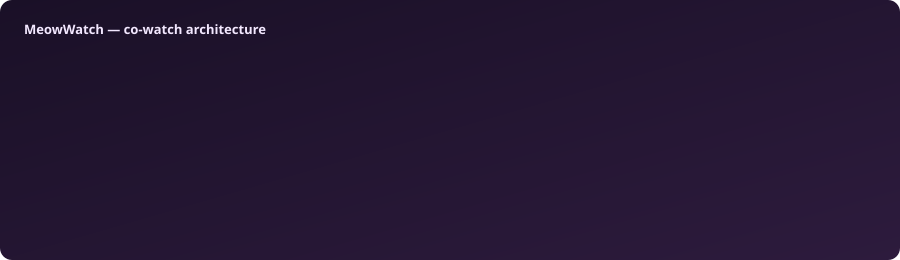

{{LOGO_BLOCK}}<h1 align="center">{{PRODUCT_NAME}}</h1>

  <strong>{{TAGLINE}}</strong>

{{BADGES_ROW}}

  <a href="{{DOWNLOAD_URL}}"><strong>Download {{VERSION}}</strong></a>
  &nbsp;·&nbsp;
  <a href="{{RELEASES_URL}}">All releases</a>
  &nbsp;·&nbsp;
  <a href="{{RELEASE_NOTES_URL}}">Release notes</a>

{{HERO_BLOCK}}---

## ✨ The problem

Remote watch parties usually mean voice-call countdowns and drift. MeowWatch gives you **one room code, synchronized playback, and chat on the video** — without turning sync into the product.

## 🎬 What it does

1. **Start or join a room** — the code copies to your clipboard.
2. **Load the same video** on both machines (drag-and-drop or paste a URL).
3. **Stay in sync** — play, pause, and seek propagate through Syncplay.
4. **Talk while you watch** — floating chat, reactions, and typing indicators.

## 🎯 Features

{{FEATURES_TABLE}}

## 💬 UX decisions

{{UX_LIST}}

## ⚡ Engineering

{{ENGINEERING_LIST}}

## 🧠 Architecture

| Subsystem | Responsibility |
| --- | --- |
| VideoCore | libmpv playback, keyboard shortcuts, drag-and-drop |
| SyncCore | Syncplay TCP + startTLS, heartbeat, roster |
| ChatStore | Messages, reactions, typing over Syncplay chat + control channel |
| Data layer | Drift/SQLite — profiles, history, settings, themes |
| UpdateService | R2 manifest + Ed25519 signature verification |

Pure sync and layout logic is split from widgets for headless unit tests.

## 📦 Quick start

1. Download and extract the release zip.
2. Run `meowwatch.exe`.
3. Enter your name → **Start new room** (code copies automatically).
4. Friend pastes the code → **Join**.
5. Drop the same video on both windows.

## Compatibility

| Platform | Status |
| --- | --- |
| Windows x64 | Available |
| Windows ARM64 | Coming soon (x64 runs under emulation today) |

{{REQUIREMENTS_NOTES}}

## Status

**{{STATUS}}** — six product phases shipped (solo playback → sync → chat → connect flow → themes → polish). Source is developed privately; this repository is the public download and showcase surface. Issues are not accepted here.

Current release: **{{VERSION}}**

## License

{{LICENSE_SUMMARY}}

---

{{PRODUCT_NAME}} · {{VERSION}} · {{STATUS}}

